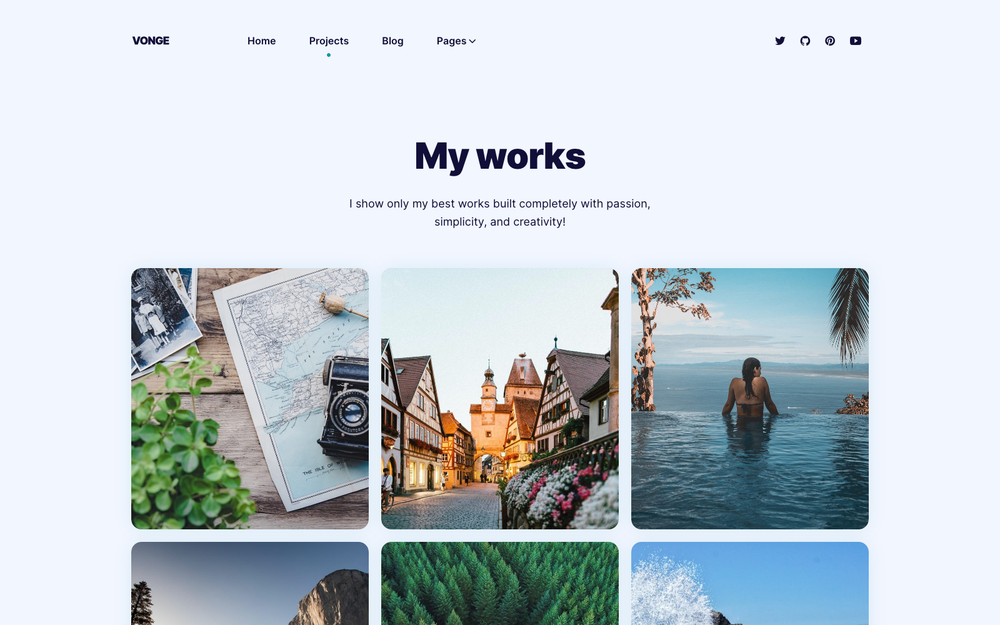

# Radha ki Rasoi

Radha ki Rasoi is a website for authentic Indian gourmet dining experiences by celebrity chef Radha (Sophia) Bangaru. 

Experience the rich flavors and traditions of Indian cuisine in an intimate, celebrity chef setting. Founded by Radha (Sophia) Bangaru, a celebrated actress from South India, our dining experiences bring authentic Indian cooking to life.

This website was built using the Vonge template by [CloudCannon](http://cloudcannon.com/), the JAMStack Cloud CMS.
The component library is built and maintained for use with [Bookshop](https://github.com/cloudcannon/bookshop/)

Find more templates, themes and step-by-step Jekyll tutorials at [CloudCannon Community](https://cloudcannon.com/community/).

## Features

* Authentic Indian dining experiences
* Celebrity chef background and story
* Traditional recipes and cooking methods
* Intimate dining settings
* Cultural storytelling through food
* Blog with culinary insights and recipes
* Contact and reservation system
* Live editing with [CloudCannon](http://cloudcannon.com/)
* Optimised for editing in [CloudCannon](http://cloudcannon.com/)
* Search engine optimisation
